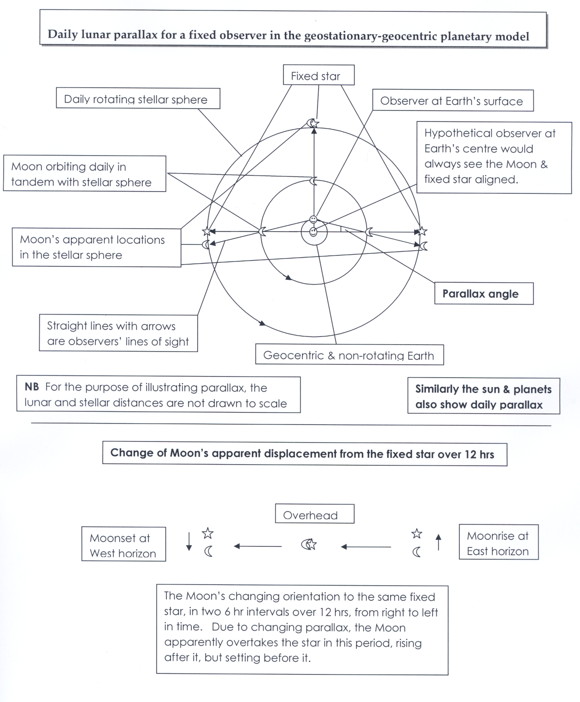

# DiurnalParallax

[](#) [](https://www.npmjs.com/package/@behaver/diurnal-parallax) [](#)

## 简介 

DiurnalParallax 是一个关于天体坐标的周日视差的计算组件，以转换站心与地心坐标

以天体月球为例，其周日视差的示意图：



## 用例

通过 npm 安装，在你的 node 项目目录下执行：

`npm i --save @behaver/diurnal-parallax`

安装完成后，调用即可：

`const DiurnalParallax = require('@behaver/diurnal-parallax');`

```js
const DiurnalParallax = require('@behaver/diurnal-parallax');
const { JDateRepository } = require('@behaver/jdate');
const SiderealTime = require('@behaver/sidereal-time');
const { SphericalCoordinate3D } = require('@behaver/coordinate/3d');
const Angle = require('@behaver/angle');

const angle = new Angle;

// 观测时间
let date = new Date('2003/08/28 11:17:00');

// 观测儒略时间
let jdate = new JDateRepository(date, 'date');

// 观测位置经纬
let obGeoLong = angle.parseDACString('116°51′50″').getDegrees();
let obGeoLat = angle.parseDACString('33°21′21″').getDegrees();

// 观测位置海拔高度，单位：千米
let elevation = 1713;

// 观测位置恒星时对象
let siderealTime = new SiderealTime(jdate, obGeoLong);

// 天体距离，单位：AU
let r = 0.37276;

// 天体球坐标 theta 值
let theta = angle.setDegrees(90 + 15.771083).getRadian();

// 天体球坐标 phi 值
let phi = angle.setDegrees(339.530208).getRadian();

// 天体位置球坐标
let gc = new SphericalCoordinate3D(r, theta, phi);

// 实例化周日视差
let dp = new DiurnalParallax({
  gc: gc,
  siderealTime: siderealTime,
  obGeoLat: obGeoLat,
  elevation: 1713,
});

// 获取站心球坐标
let tc = dp.TC;
```

## API

`constructor(options)`

构造函数，接口同 init 方法

`init(options)`

初始化方法

规定参数：

options.gc 地心球坐标，参数类型为 SphericalCoordinate3D 对象
options.tc 站心球坐标，参数类型为 SphericalCoordinate3D 对象
options.obGeoLat 观测位置地理纬度，单位：度，值域：[-90, 90]
options.siderealTime 观测位置的当地真恒星时对象，参数类型为 SiderealTime 对象
options.elevation 观测位置海拔高度，单位：米，值域：[-12000, 3e7]

`set TC(tc)`

设置站心球坐标对象

参数类型为 SphericalCoordinate3D 对象，规定参数球坐标中 r 值单位为：AU

`get TC()`

获取站心球坐标对象

`set GC(gc)`

设置地心球坐标对象

参数类型为 SphericalCoordinate3D 对象，规定参数球坐标中 r 值单位为：AU

`get GC()`

获取地心球坐标对象

## 许可证书

The MIT license.